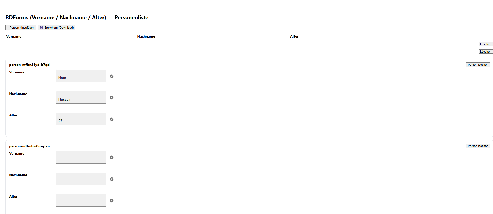

# RDForms – Personenliste (Vorname / Nachname / Alter)
##Vorschau



Dieses kleine React-Beispiel zeigt, wie man mit **RDForms** eine **Personenliste** (Array von Personen) erfasst.
Jede Person hat **Vorname**, **Nachname** und **Alter**.
Es gibt **„+ Person hinzufügen“**, **„Person löschen“** und **„Speichern (Download)“** für einen lokalen Export der Daten.

---

## Tech-Stack

* React + Vite (ES-Modules)
* [`@entryscape/rdforms`](https://rdforms.org/) (Form-Engine)
* [`@entryscape/rdfjson`](https://www.npmjs.com/package/@entryscape/rdfjson) (RDF/JSON-Graph)
* MUI (wird vom RDForms-React-Renderer intern genutzt)

---

## Voraussetzungen

* Node.js 18+
* npm

---

## Setup (neu)

```bash
# 1) Projekt erzeugen
npm create vite@latest rdforms-persons -- --template react
cd rdforms-persons

# 2) Pakete installieren
npm i @entryscape/rdforms @entryscape/rdfjson \
      @mui/material @mui/icons-material @emotion/react @emotion/styled

# 3) Vite-React-Plugin
npm i -D @vitejs/plugin-react
```

### Vite konfigurieren

Erstelle/ersetze `vite.config.js`:

```js
import { defineConfig } from 'vite'
import react from '@vitejs/plugin-react'

export default defineConfig({
  plugins: [react()],
  optimizeDeps: {
    include: ['@entryscape/rdforms', '@entryscape/rdfjson'],
    esbuildOptions: { loader: { '.js': 'jsx' } },   // RDForms hat JSX in .js
  },
  build: { commonjsOptions: { transformMixedEsModules: true } },
  resolve: { dedupe: ['react', 'react-dom'] },
})
```

---

## Code einfügen

1. Lege `src/RdPersons.jsx` an und füge **deinen aktuellen Code** ein (aus der Nachricht oben).

2. `src/App.jsx` minimal:

```jsx
import RdPersons from "./RdPersons.jsx";

export default function App() {
  return <RdPersons />;
}
```

3. Starten:

```bash
npm run dev
```

App: [http://localhost:5173/](http://localhost:5173/)

---

## Bedienung

* **+ Person hinzufügen**: erzeugt eine neue Person mit eigener URI (z. B. `http://example.com/person-…`) und zeigt unten einen RDForms-Editor an.
* **Person löschen**: entfernt alle Tripel dieser Person aus dem RDF-Graph und den Editor aus der Seite.
* **Speichern (Download)**: lädt **`persons.rdf.json`** herunter – das ist der komplette RDF/JSON-Graph (alle Personen).

> **Hinweis zur Übersichtstabelle:**
> In dieser Version liest die Tabelle die Werte direkt aus dem RDF-Graph, **rendert aber nur bei React-State-Änderungen neu** (z. B. wenn du eine Person hinzufügst/löschst oder auf „Speichern (Download)“ klickst).
> Falls du **Live-Updates beim Tippen** möchtest, siehe Abschnitt „Optional: Live-Update“.

---

## RDF-Modell

* Subjekt-URIs: `http://example.com/person-<id>`
* Prädikate:

  * `http://xmlns.com/foaf/0.1/givenName` (Vorname)
  * `http://xmlns.com/foaf/0.1/familyName` (Nachname)
  * `http://schema.org/age` (Alter, `xsd:integer`)
* **Alter** ist auf **max. 1** begrenzt ⇒ kein „+“-Knopf.

---

## Optional: Live-Update der Tabelle

Wenn die Übersicht **sofort** beim Tippen aktualisieren soll, ergänze:

1. Im Eltern-Component (`RdPersons`) einen Render-Trigger:

```jsx
const [tick, setTick] = useState(0);
const trigger = () => setTick(t => t + 1);

// rows mit useMemo neu berechnen:
const rows = useMemo(() => {
  return uris.map((u) => ({
    uri: u,
    given: firstLiteral(graph, u, "http://xmlns.com/foaf/0.1/givenName"),
    family: firstLiteral(graph, u, "http://xmlns.com/foaf/0.1/familyName"),
    age: firstLiteral(graph, u, "http://schema.org/age"),
  }));
}, [graph, uris, tick]);
```

2. Im `PersonEditor` auf Änderungen lauschen:

```jsx
function PersonEditor({ graph, resource, template, onDelete, onUpdate }) {
  // ...
  useEffect(() => {
    const editor = new Editor({ resource, graph, template, includeLevel: "optional" }, hostRef.current);
    const handler = () => onUpdate?.(resource);
    const node = hostRef.current;
    node?.addEventListener("input", handler, true);
    node?.addEventListener("change", handler, true);
    return () => {
      node?.removeEventListener("input", handler, true);
      node?.removeEventListener("change", handler, true);
      editor?.destroy?.();
    };
  }, [graph, resource, template, onUpdate]);
  // ...
}
```

3. Beim Rendern des Editors `onUpdate={trigger}` übergeben.

---

## Häufige Probleme

* **Weiße Seite / JSX-Fehler:** prüfe `vite.config.js` (insb. `optimizeDeps.esbuildOptions.loader['.js']='jsx'` und `@vitejs/plugin-react` installiert).
* **MUI-Fehler:** stelle sicher, dass `@mui/material`, `@emotion/react`, `@emotion/styled`, `@mui/icons-material` installiert sind.
* **Werte bleiben „–“:** Tabelle rendert erst bei State-Änderung → Live-Update aktivieren (siehe oben) oder kurz Person hinzufügen/löschen.

---

## Nächste Schritte

* **Import (Laden) aus Datei**: JSON einlesen und `dataRef.current = <parsed>` setzen, dann `setUris(Object.keys(parsed))`.
* **Export als Turtle**: mit [`n3`](https://www.npmjs.com/package/n3) den Graph serialisieren und als `.ttl` downloaden.
* **Speichern auf RDF-Server**: per `fetch()` an einen SPARQL/LDP-Endpoint (z. B. Oxigraph `/store` oder CSS‐Container).

Viel Spaß beim Bauen! 🚀
